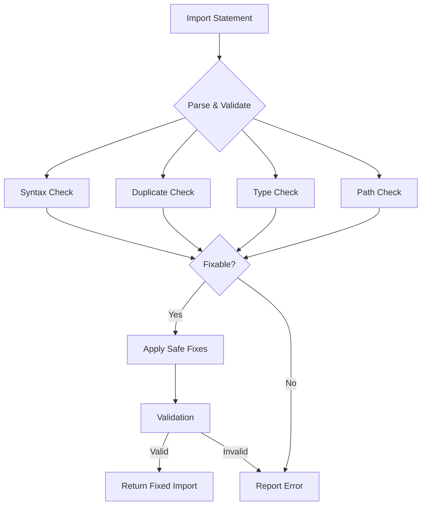

# Import Error Detection and Auto-fixing Plan

## Overview

The current import parser needs to be enhanced with error detection and safe auto-fixing capabilities. The key principle is to be very restrictive in fixes since we cannot make assumptions about the project's actual requirements.

## Current Parser Capabilities

1. Groups imports by configured patterns
2. Handles different import types (default, named, type imports)
3. Sorts imports within groups
4. Merges duplicate imports
5. Handles @app subfolder organization

## Proposed Error Detection Categories

### 1. Syntax Errors
- Missing semicolons
- Malformed import statements
- Missing commas in multi-import statements
- Unclosed braces in named imports

### 2. Duplicate Issues
- Multiple imports from same source
- Duplicate named imports
- Duplicate type imports

### 3. Type Import Issues
- Mixing type and value imports incorrectly
- Redundant type imports

### 4. Path Issues
- Case sensitivity in import paths
- Missing file extensions (when required)

## Implementation Architecture



## Core Types

```typescript
interface ImportError {
  type: 'syntax' | 'duplicate' | 'type' | 'path';
  severity: 'error' | 'warning';
  message: string;
  fixable: boolean;
  fix?: () => string;
  line: number;
  column: number;
}

interface ValidationResult {
  isValid: boolean;
  errors: ImportError[];
  fixedContent?: string;
}

interface ValidationRule {
  id: string;
  check: (importStmt: ParsedImport) => ImportError[];
  canFix: (error: ImportError) => boolean;
  fix: (importStmt: ParsedImport, error: ImportError) => string;
}
```

## Example Rules Implementation

```typescript
const rules: ValidationRule[] = [
  {
    id: 'syntax-semicolon',
    check: (stmt) => {
      // Check for missing semicolon
    },
    canFix: true,
    fix: (stmt) => `${stmt.raw};`
  },
  {
    id: 'duplicate-imports',
    check: (stmt, allStmts) => {
      // Check for duplicates
    },
    canFix: true,
    fix: (stmt, duplicates) => {
      // Merge imports safely
    }
  }
]
```

## Integration Points

1. Add validation step in ImportParser.parse()
2. Implement fix application in a new method
3. Add error reporting mechanism
4. Update return type to include validation results

## Safe Fix Guidelines

1. Only implement fixes for unambiguous cases
2. Each fix must be isolated and not affect other imports
3. Maintain original formatting where possible
4. Keep track of applied fixes for reporting

## Next Steps

1. Implement error detection layer
2. Add basic syntax validation rules
3. Implement safe fixes for common issues
4. Add test cases for error detection
5. Document supported fixes and limitations